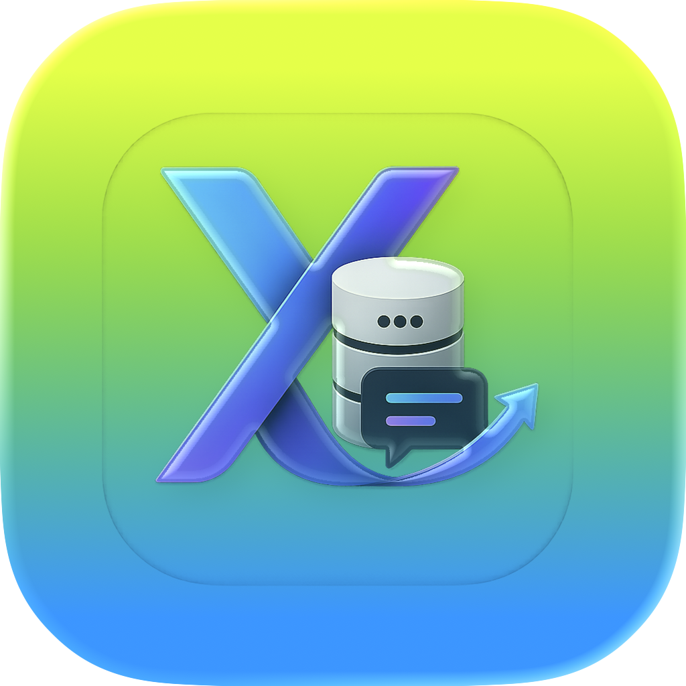
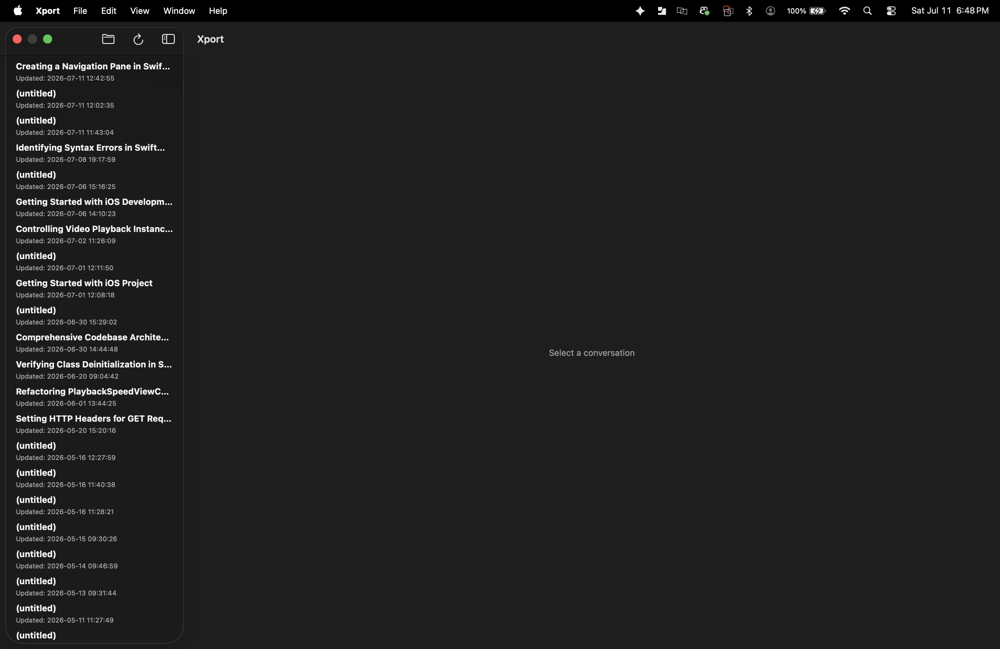
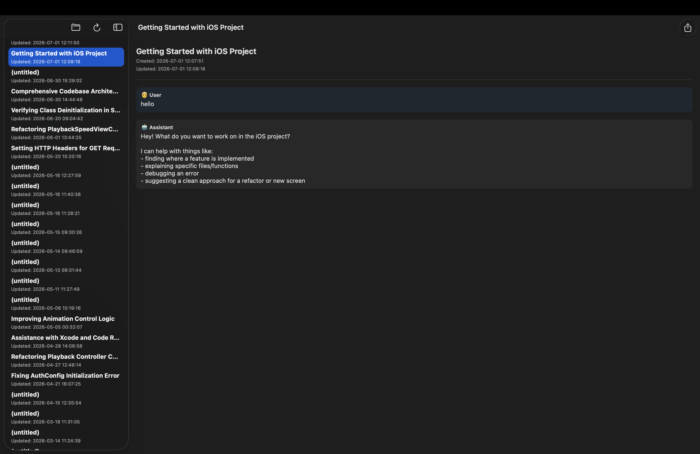
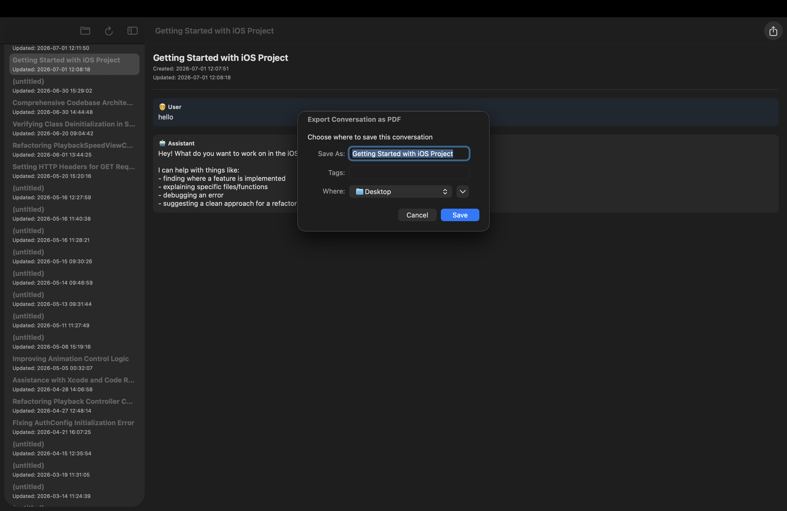

# Xport

**Xport** is a native macOS app for browsing and exporting local AI chat history stored in SQLite `.db` files — like the conversation logs GitHub Copilot for Xcode keeps on disk.

Point it at a folder, browse your conversations in a familiar two-pane layout, and export any conversation to a clean, paginated PDF — with code blocks rendered like an editor, not as plain text.

## Motivation

Copilot for Xcode doesn't offer a way to copy an entire conversation out of a single chat window — so Xport started as a workaround: a way to actually get a full chat transcript out and into a shareable format.

<div align="center">
  
</div>


Copilot for Xcode doesn't offer a way to copy an entire conversation out of a single chat window — so Xport started as a workaround: a way to actually get a full chat transcript out and into a shareable format.

## Features

- 📂 **Sandbox-safe folder access** — pick a folder once via a native file picker; Xport remembers it (security-scoped bookmark) for next launch
- 🗂 **Fast conversation list** — reads only lightweight metadata up front, so the sidebar populates instantly and stays sorted by most recently updated
- ⚡️ **Lazy transcript loading** — a conversation's messages are fetched on demand when you open it, with a loading indicator, and the load auto-cancels if you switch away before it finishes
- 💻 **Code-aware rendering** — fenced ` ```code``` ` blocks are detected and displayed in a monospaced, editor-style panel with a copy button, both on screen and in exports
- 📄 **PDF export** — export any conversation to a properly paginated PDF via a native save panel, styled consistently regardless of system light/dark mode

## Requirements

- macOS 14 (Sonoma) or later
- Xcode 16 or later
- Swift 5.10+

## Getting Started

```bash
git clone https://github.com/<your-username>/xport.git
cd xport
open Xport.xcodeproj
```

Build and run (`⌘R`). On first launch, click **Choose Folder** and select the directory containing your `.db` files (for example, GitHub Copilot for Xcode's conversation store at `~/.config/github-copilot/xcode/<id>/conversations`).

## Usage

1. Point Xport at your .db files

Click the folder icon in the toolbar to choose the directory where your Xcode Copilot chat history is stored locally. Xport scans it for .db files and lists every conversation it finds, sorted by most recently updated.



2. Browse a conversation

Select a title from the sidebar and its full transcript loads on the right, with user and assistant turns clearly separated.



3. Export to PDF

Click the share button in the top-right corner to export the open conversation as a PDF to any folder you choose.



## How It Works

Each `.db` file is expected to contain two tables:

| Table          | Purpose                                                   |
|----------------|------------------------------------------------------------|
| `Conversation` | One row per conversation: `id`, `title`, `createdAt`, `updatedAt` |
| `Turn`         | One row per message: `id`, `conversationID`, `role`, `data` (JSON blob) |

Xport reads `Conversation` rows up front to build the list, then reads a conversation's `Turn` rows only when you open it.

## Project Structure

This project follows **MVVM**, with an Xcode 16 file-system-synchronized group (no manual project file wrangling needed when you add files):

```
Xport/
├── App/
│   └── XportApp.swift                    — @main entry point
├── Models/
│   ├── ConversationRecord.swift          — Conversation table row
│   ├── TurnRecord.swift                  — Turn table row
│   └── MessageSegment.swift              — parsed text/code chunk of a message
├── Services/
│   ├── SQLiteHelper.swift                — raw sqlite3 C-API column readers
│   ├── DatabaseReader.swift              — file discovery + SQL queries
│   ├── TurnTextExtractor.swift           — extracts message text from Turn JSON
│   ├── MarkdownCodeParser.swift          — splits text into prose/code segments
│   ├── FolderAccessService.swift         — NSOpenPanel + security-scoped bookmarks
│   └── PDFExportError.swift              — PDFExportService (Core Text PDF rendering)
├── ViewModels/
│   ├── ConversationListViewModel.swift
│   └── ConversationDetailViewModel.swift
└── Views/
    ├── ConversationListView.swift
    ├── ConversationDetailView.swift
    └── MessageContentView.swift          — editor-style code block rendering
```

## Known Limitations

- macOS only (uses AppKit APIs — `NSOpenPanel`, `NSSavePanel`, Core Text PDF rendering)
- Assumes the `Conversation` / `Turn` schema described above; other chat-log schemas aren't supported yet
- No search or filtering within the conversation list yet

## Roadmap

- **Broader source support** — extend export beyond Copilot-style `.db` files to conversations from any MCP (Model Context Protocol) source

## Contributing

Contributions are welcome! Please open an issue to discuss significant changes before submitting a PR. See [CONTRIBUTING.md](CONTRIBUTING.md) for guidelines.

## License

Distributed under the MIT License. See [LICENSE](LICENSE) for details.
